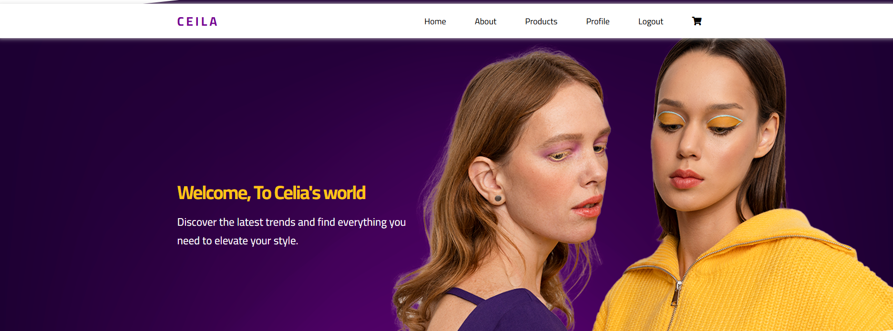

# Alx Webstack Portfolio Project
# Ceila online shop application

## Overview

This project is a comprehensive e-commerce platform built with Flask, SQLAlchemy, and Bootstrap. It allows users to register, login, browse products, add items to cart, view their shopping cart, and place orders. Administrators have additional features like adding/editing/deleting products and managing orders.
This project was developed by:
- **Amira Ragab** - [amiraragab480@gmail.com](mailto:amiraragab480@gmail.com)

## Setup Instructions

1. Clone the repository:
   git clone https://github.com/MIRARG20/alx-webstack-portfolio-project.git cd alx-webstack-portfolio-project

2. Install dependencies:
    pip install -r requirements.txt
    Flask==2.0.1
    SQLAlchemy==1.4.26
    Werkzeug==2.0.1
    Flask-SQLAlchemy==3.0.0
    Flask-Login==0.5.0
    Flask-WTF==1.0.0

3. Set up the database:
   flask db upgrade

4. Start the server:
   flask run

5. Access the application at `http://localhost:5000`

## Usage Guidelines

### User Authentication

- Register for a new account at `/register`
- Login at `/login` (or automatically login if already authenticated)

### Browsing Products

- View products at `/products`

### Shopping Cart

- Add items to cart at `/add-to-cart/<int:item_id>`
- View cart at `/cart`
- Update cart quantity at `/update-cart/<int:product_id>`
- Remove item from cart at `/remove-from-cart/<int:product_id>`

### Placing Orders

- Complete checkout process at `/cart` to place an order

### Admin Features (Requires Admin Login)

- Access admin panel at `/shop-items`
- Manage orders at `/orders`

## Project Architecture

The project uses a modular structure with separate files for different functionalities:

- `routes.py`: Defines all Flask routes
- `models.py`: Contains SQLAlchemy models for database entities
- `forms.py`: Defines Flask-WTF forms for user input validation
- `templates/`: Contains HTML templates for various pages
- `static/`: Contains static files like CSS and JavaScript

## Contributing

Contributions are welcome! Please feel free to submit pull requests or issues.

## License

This project is licensed under the MIT License - see the [LICENSE](LICENSE) file for details.
